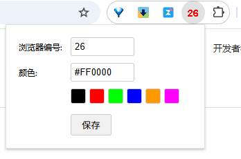

# 显示浏览器编号 (Show Browser ID)

[![License: GPL v3][license-shield]][license-url]

一款简洁的 Chrome 扩展程序，允许你在浏览器工具栏图标上显示一个自定义的数字编号和颜色。这对于同时使用多个 Chrome 用户配置（Profile）并希望快速区分它们的用户非常有用。

## ✨ 功能特性

*   **自定义编号**: 设置一个 1 到 3 位的数字作为浏览器标识。
*   **自定义颜色**: 选择编号文本的显示颜色。
*   **实时更新**: 保存设置后，工具栏图标会立即更新。
*   **设置同步**: 使用 `chrome.storage.sync` 保存设置，如果你的 Chrome 浏览器开启了同步功能，设置将在你的不同设备间同步。
*   **简洁界面**: 提供一个简单直观的弹出窗口来更改设置。
*   **颜色预设**: 包含几个常用的颜色预设，方便快速选择。

## 🚀 安装

1.  **下载**: 克隆 (clone) 或下载此仓库的代码到你的本地计算机。
2.  **加载扩展**:
    *   打开 Chrome 浏览器。
    *   在地址栏输入 `chrome://extensions/` 并访问。
    *   在页面右上角，打开"**开发者模式**"开关。
    *   点击左上角的"**加载已解压的扩展程序**"按钮。
    *   在弹出的文件选择框中，选择你刚刚下载并解压的扩展程序文件夹。
3.  **完成**: 扩展图标将出现在浏览器工具栏上。

## 🎯 使用方法

1.  **打开设置**: 点击浏览器工具栏上的扩展图标，打开弹出窗口。
2.  **输入编号**: 在"浏览器编号"输入框中，输入 1 到 3 位的数字。
3.  **选择颜色**:
    *   在"颜色"输入框中，输入一个有效的十六进制颜色代码 (例如 `#FF0000`, `#008000`)。
    *   或者，点击下方预设的颜色方块快速选择颜色。
4.  **保存**: 点击"保存"按钮。
5.  **查看结果**: 扩展图标将立即更新为你设置的编号和颜色。

## 🤝 贡献

欢迎各种形式的贡献！包括但不限于：
*   提交问题 (Issues)
*   创建拉取请求 (Pull Requests)
*   提出功能建议
*   报告 Bug

## 📜 开源许可

本项目采用 **GNU General Public License v3.0 (GPLv3)** 开源。
这意味着你可以自由地使用、修改和分发此软件，但**任何修改或衍生版本也必须以 GPLv3 协议开源，并且不允许将此代码用于闭源商业项目或进行销售牟利**。
详情请见 [LICENSE](LICENSE) 文件（你需要添加一个包含 GPLv3 文本的 LICENSE 文件，或者你可以直接链接到官方许可证文本）。

<!-- Markdown link & img dfn's -->
[license-shield]: https://img.shields.io/badge/License-GPLv3-blue.svg?style=flat-square
[license-url]: https://www.gnu.org/licenses/gpl-3.0